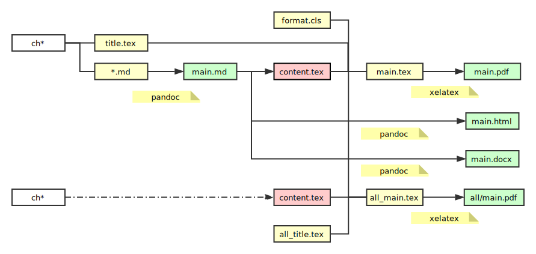

# Front-End-Book

内容主要是整理, 存在引用不规范的地方.

## requirements

1. [pandoc](http://www.pandoc.org/): pandoc 1.19.2.1 (2.1.1编译通不过).
2. [TeX Live](https://tug.org/texlive/): TeX Live 2017 可编译通过, 其他版本未测试.

## build

1. `src` 编译公共资源及脚本.
2. `dist` 编译输出.
3. `bash build.sh` 编译.

## files

1. `ch1_fundamental` 基础.
2. `ch2_frameworks` 框架.
3. `ch3_tools` 工具.
3. `ch4_optimization` 优化.
5. `ch5_solutions` 方案.

## 编译结果说明

1. 输出格式: pdf, markdown, docx, html, latex
2. PDF 代码复制不包含行号, 支持的阅览器: Adobe Acrobat Reader DC; 不支持的阅览器: Sumatra PDF, Foxit Reader. [Does the trick that prevents to copy the line numbers work anymore?](https://tex.stackexchange.com/questions/123638/does-the-trick-that-prevents-to-copy-the-line-numbers-work-anymore)

## pandoc markdown 转换的几个问题

1. md -> latex, 长表格内单个汉字换行, 导致表格无法完整显示: 现将所有多个 md 文件转行成单个 md 文件 `pandoc -s *.md -o single.md`.
2. md 文件顶部含 yaml meta 信息的, pandoc 处理时不会显示正在正文中, 可不用去除, 例如 jekyll 博客文件. 具体参考: [etadata-blocks](http://pandoc.org/MANUAL.html#metadata-blocks).
3. md -> latex, 代码默认转换成 `verbatim`, 如果要转换成 `listings` 则需要在命令行加参数: `pandoc --listings`.
4. md -> latex, 其他转换后编译时出现的问题, 可见 `format.cls`.
5. 多个文件转换顺序的排序, 根据对文件名命名实现.

## 扩展

1. [OpenSourceBook](https://github.com/Xuanwo/OpenSourceBook)
2. [Wandmalfarbe/pandoc-latex-template](https://github.com/Wandmalfarbe/pandoc-latex-template)
3. [pandoc-starter](https://github.com/jez/pandoc-starter)

